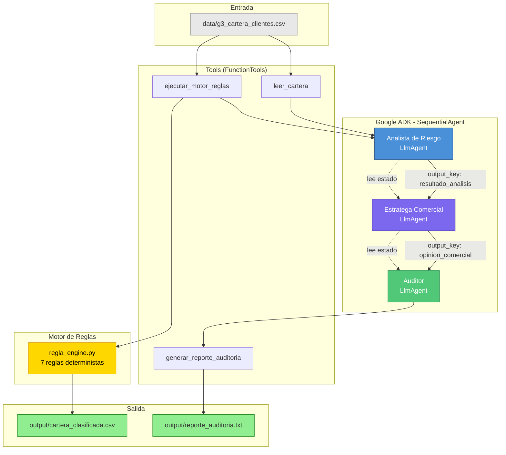
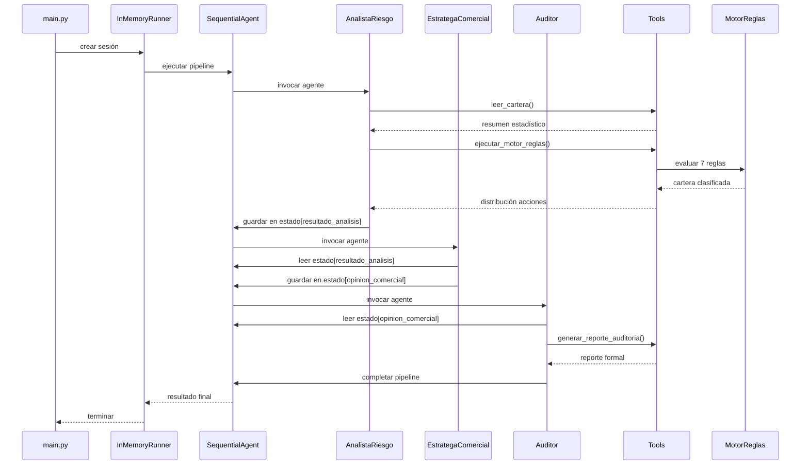
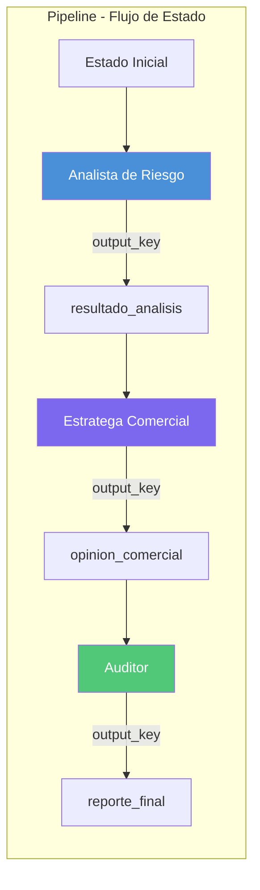
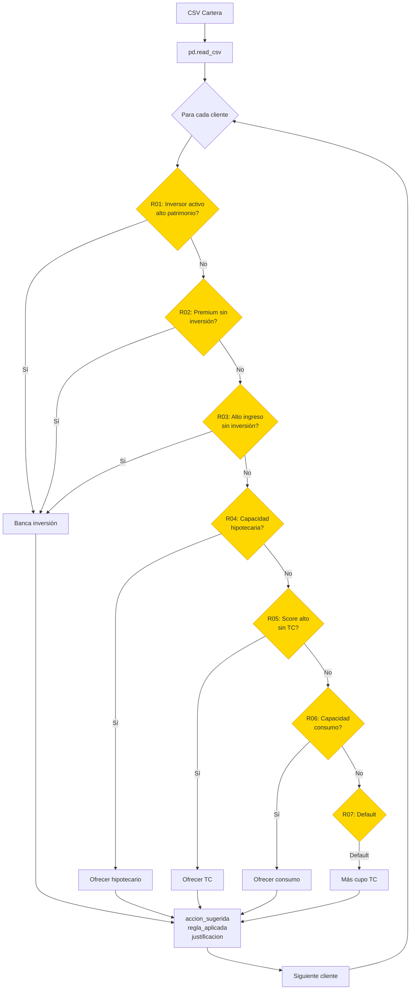
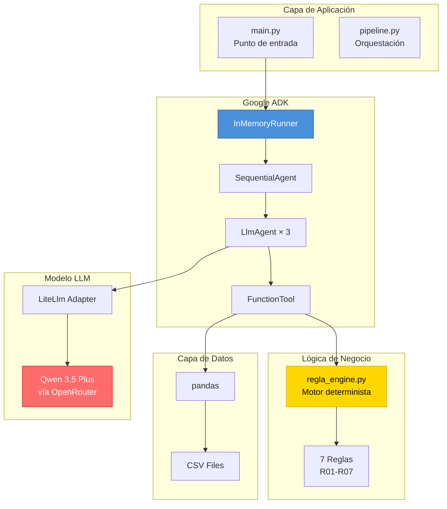
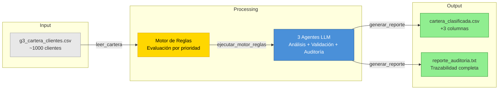
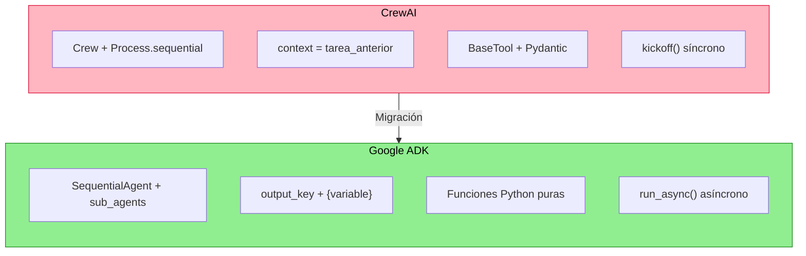

# Arquitectura — Clasificación de Cartera Bancaria con Google ADK

## Diagrama General

## Flujo de Ejecución

## Componentes Principales

### 1. Pipeline Secuencial (SequentialAgent)

### 2. Motor de Reglas Determinista

### 3. Stack Tecnológico

## Catálogo de Reglas

| Código | Nombre | Acción | Prioridad |
|--------|--------|--------|-----------|
| R01 | Inversor activo de alto patrimonio | Banca de inversión | 1 |
| R02 | Premium con patrimonio líquido sin inversión | Banca de inversión | 2 |
| R03 | Alto ingreso y saldo sin inversión | Banca de inversión | 3 |
| R04 | Alta capacidad con estabilidad demostrada | Ofrecer hipotecario | 4 |
| R05 | Score alto sin tarjeta de crédito | Ofrecer TC | 5 |
| R06 | Capacidad de crédito de consumo | Ofrecer consumo | 6 |
| R07 | Default — Cliente estándar | Más cupo TC | 7 |

## Flujo de Datos

## Diferencias CrewAI vs Google ADK

